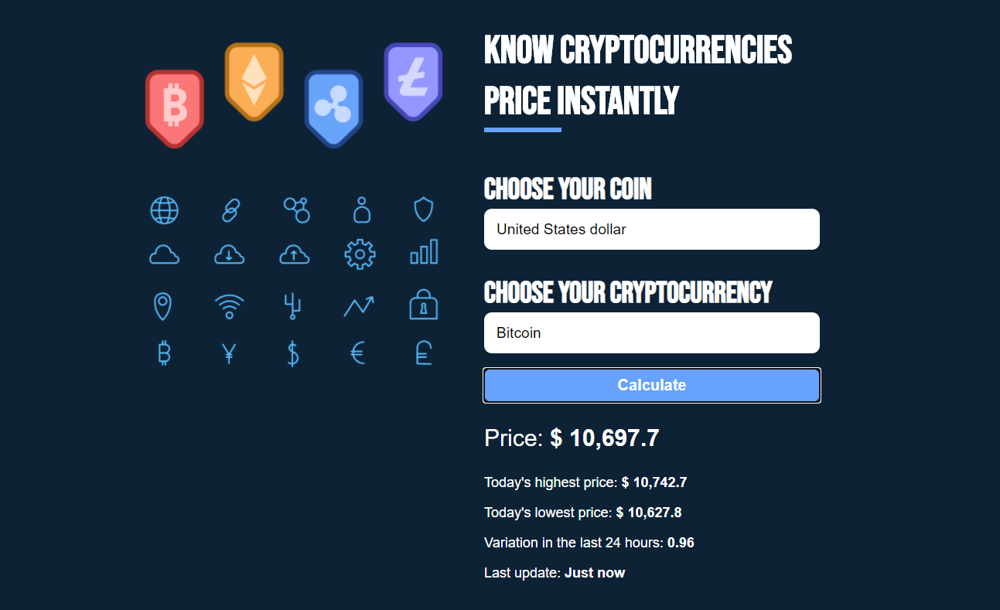

# Cryptocurrency React App

 

## Built With

* [React](https://reactjs.org/)
* [React Hooks](https://es.reactjs.org/docs/hooks-intro.html)
* [NodeJs](https://nodejs.org/en/)
* [JavaScript](https://en.wikipedia.org/wiki/JavaScript)
* [Css](https://en.wikipedia.org/wiki/CSS)
* [Crypyocurrencies API](https://min-api.cryptocompare.com/data/top/mktcapfull?limit=10&tsym=USD)


## Getting Started

### Prerequisites

For this project you need:

```
Nodejs
```

### Installing

Go to cryptocurrency-price/client and run:

```
npm install
```

## Running React

In the same folder run:

```
npm start
```

Now you can use Cryptocurrency React App!
